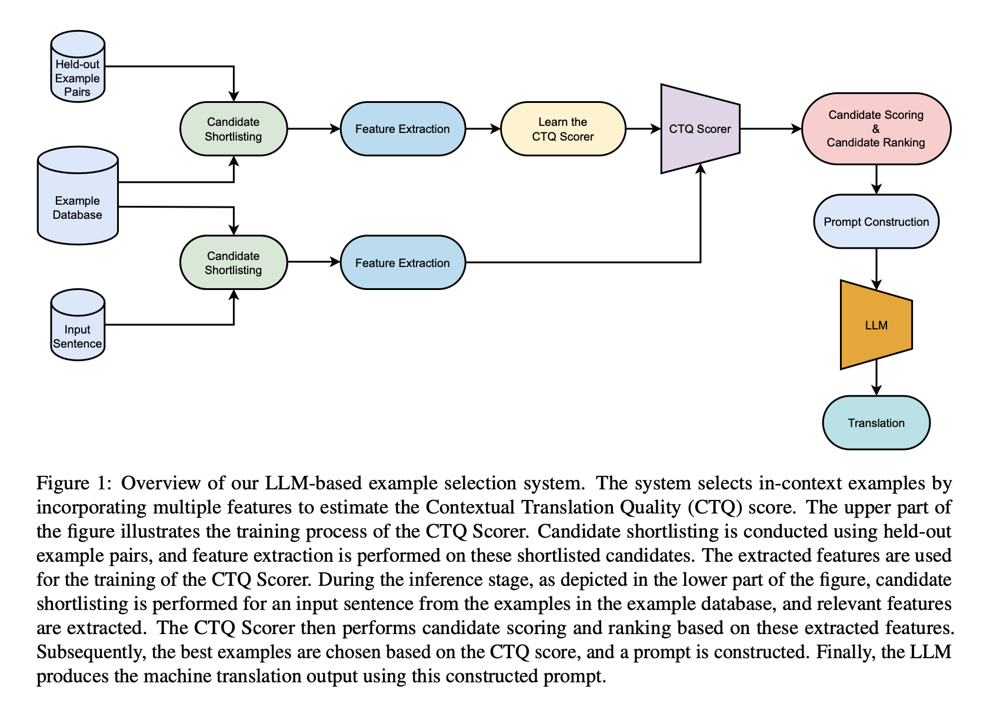

# CTQScorer

Implementation of the Example Selection framework, evaluation and experiments in our EMNLP 2023 paper: [CTQScorer: Combining Multiple Features for In-context Example Selection for Machine Translation](https://arxiv.org/abs/2305.14105).
```
@article{kumar2023context,
  title={In-context Example Selection for Machine Translation Using Multiple Features},
  author={Kumar, Aswanth and Kunchukuttan, Anoop and Puduppully, Ratish and Dabre, Raj},
  journal={arXiv preprint arXiv:2305.14105},
  year={2023}
}
``` 

Below are the details about the datasets and scripts for reproducing the results reported in the paper.

## 0. Prerequisites
The code requires `python 3.8+` 

Clone this repository on your machine - `git clone https://github.com/ashwanth10/CTQScorer.git` 

create a conda environment using ```conda create --name ctqscorer python=3.8``` command and activate it using   ```conda activate ctqscorer```

Install requirements by typing the following commands:
```
conda install pytorch torchvision torchaudio pytorch-cuda=11.7 -c pytorch -c nvidia
pip install -r requirements.txt
``` 

Download and unpack the dataset into ```./dataset``` in the main ```CTQScorer``` folder. 

### 0.1 Downloading the Dataset
run the following the commands from the root of the directory
```
cd dataset
chmod +x prepare_datasets.sh
./prepare_datasets.sh
```

After downloading, you'll have multiple sub-folders with multiple files in each sub-folder. The folders `europarl`, `paracrawl` and `samanantar` are parallel datasets with two files in each sub-folder, `train.xx` and `train.en.` The folders `test` and `train` are the test and development sets from `FLORES`. The folder structure will be as follows:
```
dataset
├── europarl
│   ├── en-de
│   │   ├── train.de
│   │   └── train.en
│   └── en-fr
│       ├── train.en
│       └── train.fr
├── paracrawl
│   └── en-ru
│       ├── train.en
│       └── train.ru
├── samanantar
│   ├── en-as
│   │   ├── train.as
│   │   └── train.en
│   ├── en-bn
│   │   ├── train.bn
│   │   └── train.en
│   ├── en-gu
│   │   ├── train.en
│   │   └── train.gu
│   ├── en-hi
│   │   ├── train.en
│   │   └── train.hi
│   ├── en-kn
│   │   ├── train.en
│   │   └── train.kn
│   ├── en-ml
│   │   ├── train.en
│   │   └── train.ml
│   ├── en-mr
│   │   ├── train.en
│   │   └── train.mr
│   ├── en-or
│   │   ├── train.en
│   │   └── train.or
│   ├── en-pa
│   │   ├── train.en
│   │   └── train.pa
│   ├── en-ta
│   │   ├── train.en
│   │   └── train.ta
│   └── en-te
│       ├── train.en
│       └── train.te
├── test
│   ├── asm_Beng.devtest
│   ├── ben_Beng.devtest
│   ├── deu_Latn.devtest
│   ├── eng_Latn.devtest
│   ├── fra_Latn.devtest
│   ├── guj_Gujr.devtest
│   ├── hin_Deva.devtest
│   ├── kan_Knda.devtest
│   ├── kas_Arab.devtest
│   ├── kas_Deva.devtest
│   ├── mai_Deva.devtest
│   ├── mal_Mlym.devtest
│   ├── mar_Deva.devtest
│   ├── mni_Beng.devtest
│   ├── npi_Deva.devtest
│   ├── ory_Orya.devtest
│   ├── pan_Guru.devtest
│   ├── rus_Cyrl.devtest
│   ├── san_Deva.devtest
│   ├── sat_Olck.devtest
│   ├── snd_Arab.devtest
│   ├── spa_Latn.devtest
│   ├── tam_Taml.devtest
│   ├── tel_Telu.devtest
│   └── urd_Arab.devtest
└── train
    ├── asm_Beng.dev
    ├── ben_Beng.dev
    ├── deu_Latn.dev
    ├── eng_Latn.dev
    ├── fra_Latn.dev
    ├── guj_Gujr.dev
    ├── hin_Deva.dev
    ├── kan_Knda.dev
    ├── kas_Arab.dev
    ├── kas_Deva.dev
    ├── mai_Deva.dev
    ├── mal_Mlym.dev
    ├── mar_Deva.dev
    ├── mni_Beng.dev
    ├── npi_Deva.dev
    ├── ory_Orya.dev
    ├── pan_Guru.dev
    ├── rus_Cyrl.dev
    ├── san_Deva.dev
    ├── sat_Olck.dev
    ├── snd_Arab.dev
    ├── spa_Latn.dev
    ├── tam_Taml.dev
    ├── tel_Telu.dev
    └── urd_Arab.dev

19 directories, 78 files
```

## 1. Example Quality Features
Since there is a large number of examples in the Example Database (dataset folder), it is not possible to compute all Example Quality features for them. We choose the `BM25` algorithm to filter and obtain a pool of 100 examples for each input sample. From this pool of examples, we apply different algorithms and rank them. The algorithms can be found in the `generateranking` folder.

### 1.1 Algorithms
We choose several algorithms relevant to example selection based on features like example similarity, example quality, and perplexity-based features. The algorithm and the features based on which it ranks are as follows:

|Algorithm|Feature(s) computed|
|:----|:----|
|rankings_bm25|BM25|
|rankings_bm25_and_3_way|LaBSE-InSrc, LaBSE-InTgt, LaBSE-SrcTgt, ScAvg|
|rankings_bm25_and_chrf|chrF-InSrc|
|rankings_bm25_and_perplexity|PPL-SrcTgt, PPL-SrcTgtIn|
|rankings_bm25_and_reranking|R-BM25|
|rankings_comet_qa|Cmt-InSrc, Cmt-InTgt, Cmt-SrcTgt|
|rankings_no_of_tokens|NumTokIn, NumTokSrc, NumTokTgt|

### 1.2 Running the Example quality ranking algorithm
The code to run the algorithm is present in the file `rankings_generate.py`. It can be run in a shell script for all features, as shown in the script `rankings_generate.sh`, or it can be run using the following command for each language/feature:

```
python rankings_generate.py \
--train_src {train_src} \
--test_src {test_src} \
--src_lang {src_lang} \
--dst_lang {dst_lang} \
--algorithm {algorithm} >> rankings_generate.log
```

`--train_src` - examples database from which examples are to be choosen
<br>
`--test_src` - held-out examples from which input examples are choosen. 
<br>
`--src_lang` - source language
<br>
`--dst_lang` - destination language
<br>
`--algorithm` - choose one of algorithm mentioned in the table.

Optionals arguments:

Adding `--devset` picks the examples from devset else from testset for `test_src`.
<br>
Adding `--xglm` the model uses xglm for computing perplexity features else it uses bloom model.

### 1.3 Ranking format
The rankings based on each feature are stored in JSON files for each language translation direction.
```
rankings_bm25
├── recommendations_europarl_flores_deu_Latn_eng_Latn.json
├── recommendations_europarl_flores_eng_Latn_deu_Latn.json
├── recommendations_europarl_flores_eng_Latn_fra_Latn.json
├── recommendations_europarl_flores_fra_Latn_eng_Latn.json
├── recommendations_paracrawl_flores_eng_Latn_rus_Cyrl.json
├── recommendations_paracrawl_flores_rus_Cyrl_eng_Latn.json
├── recommendations_samanantar_flores_ben_Beng_eng_Latn.json
├── recommendations_samanantar_flores_eng_Latn_ben_Beng.json
├── recommendations_samanantar_flores_eng_Latn_guj_Gujr.json
├── recommendations_samanantar_flores_eng_Latn_hin_Deva.json
├── recommendations_samanantar_flores_guj_Gujr_eng_Latn.json
└── recommendations_samanantar_flores_hin_Deva_eng_Latn.json
```

Inside each JSON file, for each input sample index, 100 indexes from the example database are stored and sorted based on their scores. The ranking is stored as follows:
```
{
    "0": [
        {
            "index": 442330,
            "score": 26.32
        },
        {
            "index": 67907,
            "score": 25.95
        },
        ... 100 indexes
    ], 
    "1": [
        ... 100 indexes
    ]
    ...
    "last_index_of_input_sample": [
        ... 100 indexes
    ]
}
```

For convenience, we computed the rankings across all features/languages and added them to the repository. They are stored in the `example_selection_test_data` folder for the test set and `example_selection_train_data` for the training set.

## 2. Generate Machine Translation
Using the command below, you can obtain machine translations from the model and assess the translation quality using different algorithms for example selection.

```
python translate_and_eval.py \
--train_src {train_src} \
--test_src {test_src} \
--src_lang {src_lang} \
--dst_lang {dst_lang} \
--algorithm {algorithm} >> translate_and_eval.log
```

`--train_src`, `--test_src`, `--src_lang`, `--dst_lang` mean the same as mentioned in previous section.
<br>
`--algorithm` - choose one of algorithm mentioned in script `translate_and_eval.sh`.

Optionals arguments:

`--xglm` - the model uses xglm for generating the translation else it uses bloom model
<br>
`--shots` - number of shots for the in-context learning (by default 4)
<br>
`--b2w` - order the shots from the best to worst measure of their score (by default it is w2b)
<br>
`--experiment` - name/tag to keep track of the experiment


The translated sentences are stored inside the `outputs` folder, where each file corresponds to an input test set. The translation quality is saved in the `outputs/scores.csv` file. We also keep track of the prompts in the `prompts` folder.

## 3. CTQScorer: Example Selection framework


### 3.1 Generating training data
To train the CTQScorer, we need to generate training data. We used the Flores devset as input samples and the existing Example database as training samples to generate the CTQ scores. These scores, in combination with the example features collected for the same samples, form the training data. The Flores devset consists of 997 samples, and by choosing a pool of 100 BM25 pairs for each sample, we generate 99,700 (997 x 100) samples as our training data for each language. For our experiments, we attempted to learn the COMET score as the CTQScore (although it can be any other translation quality metric). The following is the command to generate training data:
```
python generate_ctqscorer_train_data.py \
--train_src {train_src} \
--test_src {test_src} \
--src_lang {src_lang} \
--dst_lang {dst_lang} >> generate_ctqscorer_train_data.log
```
`--train_src`, `--test_src`, `--src_lang`, `--dst_lang` mean the same as mentioned in previous sections.

Optional argument:

`--xglm` - the model uses xglm for generating the translation else it uses bloom model.

Refer the script `generate_ctqscorer_train_data.sh` for generating training data for all languages.

### 3.2 Cummulating translation scores and features
In the above script, we obtained the Y part of the dataset. Using the command for computing Example Features quality, we can obtain the X part for the devset. Run the command below to combine both X and Y and obtain training data:
```
python cummulate_features.py \
--train_src {train_src} \
--test_src {test_src} \
--src_lang {src_lang} \
--dst_lang {dst_lang} \
--devset >> cummulate_features.log
```
`--train_src`, `--test_src`, `--src_lang`, `--dst_lang` mean the same as mentioned in previous sections.

The cummulated training dataset is stored inside the `dataset_train` folder, with each file as `{train_src}_{src_lang}_{dst_lang}.csv`. The command for this is:

<br>

The same command without the `--devset` argument results in the test dataset for which we would like to predict the CTQ Score. 
```
python cummulate_features.py \
--train_src {train_src} \
--test_src {test_src} \
--src_lang {src_lang} \
--dst_lang {dst_lang} >> cummulate_features.log
```
The cummulated testset is stored inside the `dataset_test` folder.

### 3.3 Training CTQScorer
Now that the training data is ready, we can train the CTQScorer. The command below requires the user to log in to Wandb, where the best hyperparameters are recorded:
```
python ctqscorer.py \
--train_src {train_src} \
--test_src {test_src} \
--src_lang {src_lang} \
--dst_lang {dst_lang} \
--train >> ctqscorer.log
```

Once the training is completed, take note of the best hyperparameters from Wandb. You can predict the CTQScorer scores for input samples by updating the best hyperparameters in the command below:
```
python ctqscorer.py \
--train_src {train_src} \
--test_src {test_src} \
--src_lang {src_lang} \
--dst_lang {dst_lang} \
--activation {ctivation function name (relu/tanh/sigmoid)} \
--batch_size {batch size}
--learning_rate {learning_rate}
--neurons_hidden_layer {number of neurons in eachh hidden layer}
--no_of_hidden_layer {number of hidden layers}
--epochs {number of epochs}
--optimizer {optimizer function name (adam,rmsprop,sgd)}
--weight_decay {weight decay} >> ctqscorer.log
```

The commands above generate a file in the `example_selection_test_data/rankings_regression` folder where each example index is sorted based on the CTQ score. You can now assess the translation quality by selecting the examples based on CTQ scores using the command below:

```
python translate_and_eval.py \
--algorithm rankings_regression \
--train_src {train_src} \
--test_src {test_src} \
--src_lang {src_lang} \
--dst_lang {dst_lang} \
--experiment ctqscorer_exp >> translate_and_eval.log
```

## 4. Baselines
The COMET scores for all the baselines and example selection based on individual features while translating to English are presented below:
|<b>Selection Method</b>|<b>bn</b>|<b>gu</b>|<b>hi</b>|<b>de</b>|<b>fr</b>|<b>ru</b>|<b>Average</b>|
|:----|:----|:----|:----|:----|:----|:----|:----|
|Random Selection|40.07|38.27|44.52|63.05|70.89|49.40|51.03|
|BM25|38.93|38.42|45.18|62.14|70.82|45.76|50.21|
|R-BM25|39.97|38.16|45.20|62.94|70.31|49.28|50.98|
|CTQ (<b>ours</b>)|<b>42.99</b>|<b>41.77</b>|<b>50.03</b>|<b>64.77</b>|71.28|50.85|<b>53.62</b>|
|CTQ-QE (<b>ours</b>)|38.56|40.45|45.40|64.13|<b>71.33</b>|50.72|51.76|
|NumTokSrc|38.02|39.53|42.23|61.88|70.57|47.50|49.96|
|NumTokTgt|39.44|35.06|39.33|61.95|70.66|45.38|48.64|
|CmtQE-InSrc|39.17|38.02|44.77|63.57|69.94|50.25|50.95|
|CmtQE-InTgt|40.33|40.28|48.07|64.76|69.82|<b>51.15</b>|52.40|
|CmtQE-SrcTgt|39.79|38.79|48.84|62.51|69.97|46.67|51.10|  
|chrF-InSrc|37.63|38.08|43.41|59.82|69.49|40.13|48.09|
|LaBSE-InSrc|40.06|37.71|46.71|63.50|70.43|48.04|51.08|
|LaBSE-InTgt|41.30|38.70|47.36|61.96|70.49|44.65|50.74|
|LaBSE-SrcTgt|41.12|40.02|48.12|62.07|70.07|39.59|50.17|  
|PPL-SrcTgt|40.52|40.91|45.39|63.62|70.87|47.22|51.42|
|PPL-SrcTgtIn|39.96|41.27|46.11|63.16|71.20|47.05|51.46|
|ScAvg (3-feat)|42.75|41.20|48.35|62.63|70.61|43.99|51.59| 
|CTQ   (3-feat)|42.07|40.65|49.63|63.77|70.85|49.31|52.71|  

We have also included the translation scores (using different metrics) for multiple translation directions in the `outputs/scores.csv` file. Additionally, each row in the file consists of a `file ID` which can be used to refer to the translations generated by the model in the same 'outputs' folder.

## 5. Misc
We also trained the model using linear regression and obtained the results for the same. The salient feature analysis for this can be found in the file `linear_regression.py`.

## License
The CTQScorer code is released under the MIT License.

## Contributors
 - Aswanth Kumar M <sub> ([IITM](https://www.iitm.ac.in)) </sub>
 - Ratish Puduppully <sub> ([A*STAR](https://www.a-star.edu.sg/i2r)) </sub>
 - Raj Dabre <sub> ([NICT](https://www.nict.go.jp/en/)) </sub>
 - Anoop Kunchukuttan <sub> ([AI4Bharat](https://ai4bharat.iitm.ac.in/), [Microsoft](https://www.microsoft.com/en-in/), [IITM](https://www.iitm.ac.in)) </sub>
	
<!-- Contact -->
### Contact
 - Aswanth Kumar M <sub> ([kumaraswanth@gmail.com](kumaraswanth@gmail.com)) </sub>
 - Ratish Puduppully <sub> ([puduppully@i2r.a-star.edu.sg](puduppully@i2r.a-star.edu.sg)) </sub>
 - Raj Dabre <sub> ([raj.dabre@nict.go.jp](raj.dabre@nict.go.jp)) </sub>
 - Anoop Kunchukuttan <sub> ([ankunchu@microsoft.com](ankunchu@microsoft.com))</sub>

## Acknowledgements
	
We would like to thank the Ministry of Electronics and Information Technology of the Government of India for their generous grant through the Digital India Bhashini project. We also thank the Centre for Development of Advanced Computing for providing compute time on the Param Siddhi Supercomputer. We also thank Nilekani Philanthropies for their generous grant towards building datasets, models, tools and resources for Indic languages. We also thank Microsoft for their grant to support research on Indic languages. We would like to thank Jay Gala and Ishvinder Sethi for their help in coordinating the annotation work. Most importantly we would like to thank all the annotators who helped create the Bhasha-Abhijnaanam benchmark.